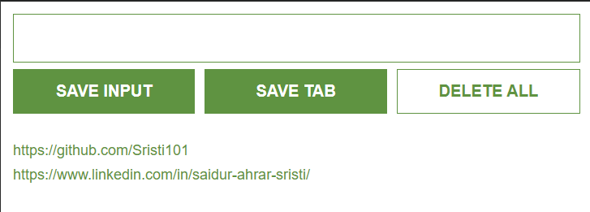

# Lead Tracker Chrome Extension

<p align="center">
  
</p>

<h3 align="center">
A simple and efficient Chrome Extension to save, manage, and revisit important URLs while browsing.
</h3>

<p align="center">
Built with JavaScript, Chrome Extension APIs, and Local Storage.
</p>

---

## Overview

**Lead Tracker** is a lightweight Chrome Extension designed to help users save useful links and manage potential leads directly from their browser.

Users can manually add URLs or instantly save the currently active browser tab. All saved leads are stored locally and remain available even after closing the browser.

This project was built to explore practical JavaScript concepts, browser APIs, and Chrome Extension development.

---

## Features

- ✅ Save leads manually through URL input
- ✅ Save the current active browser tab with one click
- ✅ Store leads permanently using Local Storage
- ✅ Dynamically display saved URLs
- ✅ Open saved links directly in a new browser tab
- ✅ Delete all saved leads
- ✅ Simple and user-friendly interface

---

## Extension Preview

<p align="center">
  
</p>

---

## Tech Stack

| Technology | Usage |
|------------|-------|
| HTML5 | Extension structure |
| CSS3 | Styling and layout |
| JavaScript (ES6) | Application logic |
| Chrome Extension API | Browser interaction |
| Local Storage API | Data persistence |

---

## Project Structure

```
lead-tracker-chrome-extension/
│
├── images/
│   ├── icon.png
│   └── extension-preview.png
│
├── index.html
├── index.css
├── index.js
├── manifest.json
│
└── README.md
```

---

## Installation & Setup

### 1. Clone the repository

```bash
git clone https://github.com/Sristi101/lead-tracker-chrome-extension.git
```

### 2. Open Chrome Extensions

Navigate to:

```
chrome://extensions/
```

### 3. Enable Developer Mode

Turn on:

```
Developer Mode → ON
```

### 4. Load the Extension

Click:

```
Load unpacked
```

Select the project folder.

The extension will now be installed locally in your Chrome browser.

---

## How It Works

### Save Input

Users can enter a URL manually and click **SAVE INPUT**.

The extension:

1. Captures the entered URL
2. Adds it to the leads array
3. Updates the interface dynamically
4. Saves the data in Local Storage


### Save Current Tab

The extension uses Chrome Tabs API:

```javascript
chrome.tabs.query()
```

to retrieve the active browser tab URL and store it automatically.

---

## Data Persistence

Lead data is stored using the browser's Local Storage API.

Save data:

```javascript
localStorage.setItem()
```

Retrieve data:

```javascript
localStorage.getItem()
```

This allows users to keep their saved leads even after restarting the browser.

---

## Learning Outcomes

Through this project, I gained experience with:

- Chrome Extension architecture
- Manifest configuration
- Browser APIs
- JavaScript DOM manipulation
- Event listeners
- Local Storage management
- Building interactive browser applications

---

## Future Improvements

- [ ] Add search functionality
- [ ] Add lead categories/tags
- [ ] Add edit and update options
- [ ] Export leads as CSV
- [ ] Add cloud synchronization
- [ ] Improve UI/UX design
- [ ] Add dark mode support

---

## Author

**Saidur Ahrar Sristi**

Computer Science & Engineering Student

GitHub:  
https://github.com/Sristi101

LinkedIn:  
https://linkedin.com/in/saidur-ahrar-sristi/

---

## Acknowledgements

Inspired by the **Lead Tracker Chrome Extension** project from **Scrimba's JavaScript Career Path**.

---

⭐ If you find this project useful, consider giving it a star!